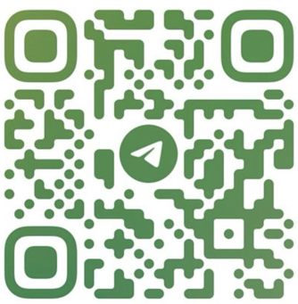

# 🪂 Bot de Entrenamiento para Licencia de Paracaidismo

Este es un **bot de Telegram creado con Node.js y Telegraf**, diseñado para ayudar a estudiantes de paracaidismo a **entrenar con preguntas de opción múltiple** basadas en el temario oficial.

> ⚠️ **Este bot es solo con fines educativos y de práctica personal.**  
> **No garantiza la aprobación del examen oficial ni reemplaza la instrucción formal certificada.**

---

## 🚀 ¿Qué hace?

- Te envía preguntas al azar con 3 opciones de respuesta.
- Te indica si tu respuesta es correcta o incorrecta.
- Lleva un registro de tu puntaje.
- Evita repetir preguntas en la misma sesión.
- Muestra tu progreso por número de pregunta.
- Se reinicia automáticamente al finalizar el test.

---

## 📱 Escaneá y empezá a practicar

Escaneá este código QR para abrir el bot en Telegram:



---

## ⚙️ Instalación local (para desarrolladores)

```bash
git clone https://github.com/tuusuario/bot-paracaidismo.git
cd bot-paracaidismo
npm install
```

Creá un archivo `.env` con tu token de BotFather:

```
BOT_TOKEN=tu_token_telegram
```

Ejecutá el bot:

```bash
node bot.js
```

---

## 🤝 Contribuciones bienvenidas

Este bot está en **etapa de prueba abierta**.  
Si querés aportar ideas, mejoras o nuevas funcionalidades, ¡sentite libre de abrir un PR o issue!

---

## 🧑‍⚖️ Disclaimer legal

Este bot **no está afiliado a ningún organismo oficial de aviación o paracaidismo**.  
Su uso es exclusivamente **voluntario y educativo**.  
No garantiza en ningún caso la obtención de licencias ni certificaciones oficiales.

---

## 📬 Contacto

¿Tenés sugerencias, correcciones o querés colaborar con el proyecto?

Podés contactarme a través de:

- 📧 **Email:** [francocsanchez@gmail.com](mailto:francocsanchez@gmail.com)
- 🌐 **GitHub:** [github.com/francocsanchez](https://github.com/francocsanchez)

> _Este proyecto está abierto al feedback de la comunidad. Toda mejora es bienvenida._

---

## 📄 Licencia

MIT – Libre para modificar, usar y compartir con atribución.
